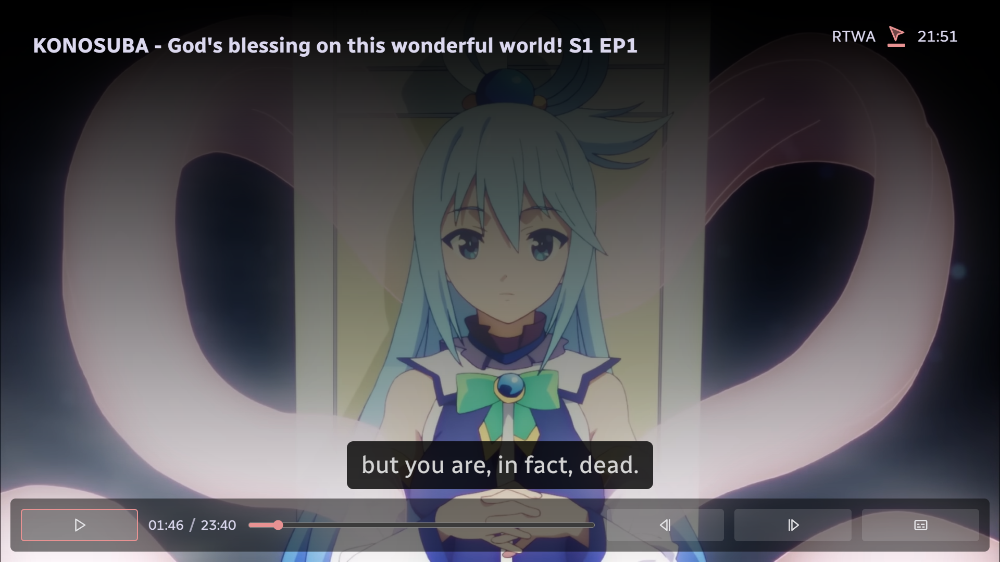

# Cherry Tree TV (indev)

An open-source, web-based front-end for your HTPC that can runs as an app using Electron.

# Features

- Use your phone as a remote
- Cast YouTube videos
- Add movies & shows to your library
- Watch videos with friends

# To-do

- [x] Movies support
- [x] Watch parties
- [x] Picture adjustments
- [ ] App store
- [ ] Friend chats
- [ ] Fully functional YouTube app
- [ ] Audio player
